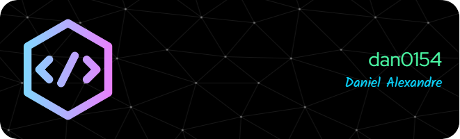

# Daniel Alexandre

## 💫 Sobre mim:
Meu nome é Daniel, sou um estudante do Ensino Médio e desejo trabalhar na área da computação assim que possível
 

## 💻 Tecnologias:

 

 

## 🔧 Ferramentas:

## 📊 GitHub Status:

 

---

